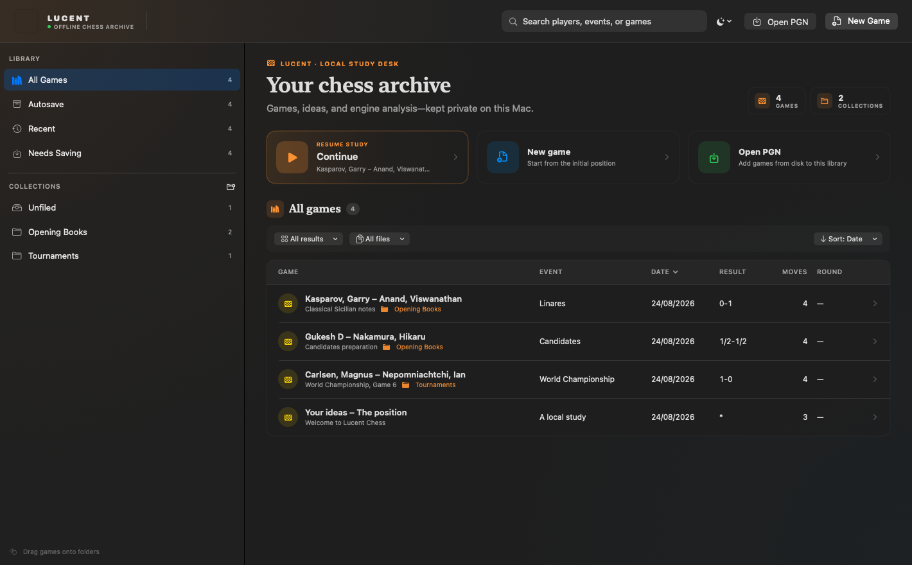

# Lucent Chess

Lucent Chess is a native, offline macOS game library and analysis workspace for PGN files with a local UCI engine.



Everything—games, notes, variations, and engine analysis—stays on the Mac.

## What it does

- Opens to a ChessBase-style game dashboard with search, file status, recent games, and one-click access to analysis.
- Gives that dashboard a restrained “quiet chess archive” identity with native SF Symbols, editorial archive headings, contextual collection metrics, softer structural borders, and a deliberately emphasized resume action.
- Offers a compact dashboard appearance switcher with persistent System, Light, and Dark modes.
- Organizes large libraries with persistent folders, Unfiled and Needs Saving views, drag-and-drop filing, and Move to Folder menus.
- Keeps new and duplicated games in a persistent Autosave smart collection until each one is explicitly saved as a PGN; edited PGNs remain separately visible in Needs Saving.
- Uses a draggable dashboard divider so the folder sidebar can be resized between a compact list and a wider library organizer.
- Keeps Library/Game transitions responsive with lazy game rows, per-game view invalidation, indexed move trees, cached positions, and one-pass dashboard queries.
- Coalesces and reduces UCI output off the main thread, publishing at most one engine snapshot every 80 ms so Stockfish cannot starve clicks or navigation.
- Captures immutable, flat recovery snapshots in a few milliseconds, then performs JSON encoding and disk writes entirely on a background queue.
- Searches across players, events, sites, ECO codes, results, and filenames; filters by result or file state; and sorts players, events, dates, results, move counts, or tournament rounds.
- Treats the game list as one continuous rounded card, with precisely matched header and body corners in both interface modes.
- Includes an optional-offline-ready starter archive of 256 unannotated games: both 2026 Candidates tournaments and all five Kasparov–Karpov World Championship matches.
- Uses a resizable board / notation / engine workspace so the position, full move tree, and analysis stay visible together.
- Centers a compact five-button game transport directly below the board for start, previous, flip, next, and end navigation.
- Displays games in compact horizontal ChessBase-style notation, with clickable moves, inline PGN comments, and correctly nested, parenthesized variations at each branch point.
- Gives the score a clear reading hierarchy: tabular move numbers recede, main-line SAN stays crisp, comments and results use restrained amber, the current move gets a rounded highlight, and clickable notation uses a link pointer.
- Saves games as real `.pgn` files with Command-S and Save As, while keeping a local recovery library between launches.
- Imports and exports PGN, including player and event metadata, nested variations, comments, NAGs, and FEN starts.
- Adds variations simply by going back and making another legal move.
- Runs Stockfish entirely on the Mac with hardware-aware defaults (6 threads, 1 GB hash, and 3 study lines on an 8-core/16 GB M1 Pro), resource presets, configurable CPU threads, hash, MultiPV, WDL estimates, and depth/time/node search limits.
- Detects every UCI option exposed by the selected engine, including Stockfish strength/Elo controls, Syzygy tablebase paths, and Clear Hash.
- Ranks engine lines in a numbered gutter and expands any line into an independent inline variation board with local move controls; only the plus button writes it into the study.
- Can switch to another local macOS UCI engine without changing the app.
- Lets you save an engine line into the move tree with one click.
- Supports click-to-move, drag-to-move, promotion, castling, en passant, board flipping, coordinates, move hints, and keyboard navigation.
- Applies moves and navigation jumps immediately, without an automatic piece transition getting between the board and the score.
- Includes 41 bundled piece sets—including an original Fritz-inspired ivory/charcoal set—and all 25 current Lichess board themes, plus custom square colors and piece scaling.
- Sizes pieces explicitly within each square, caps oversized shadows, and supplies high-resolution fallbacks for filtered sets so both inline and maximized boards stay crisp.

The visual catalog is sourced from Lichess. Attribution and applicable GPL, AGPL, Creative Commons, freeware, and non-commercial notices are bundled with the application. Two upstream sets with no stated redistribution license are intentionally omitted.

Starter game scores are sourced from The Week in Chess and PGN Mentor. Exact source URLs and retrieval details are included in `SeedGames/SOURCES.txt` inside the app bundle.

The recovery library is stored at `~/Library/Application Support/Lucent Chess/Library.json`. Games explicitly saved with Save or Save As remain ordinary PGN files wherever you put them.

## Build

On the Mac this project was created for:

```sh
./scripts/build_app.sh
```

The project has no third-party package dependencies. It targets Apple Silicon and macOS 14 or later. Lucent Chess automatically checks `/opt/homebrew/bin/stockfish`, `/usr/local/bin/stockfish`, and `/opt/local/bin/stockfish`; another UCI binary can be chosen from the slider button beside the engine controls or in Settings.

## Install

1. Download `Lucent-Chess-macOS.zip` from the latest GitHub release.
2. Unzip it and move **Lucent Chess.app** to Applications.
3. On first launch, try to open the app, then choose **System Settings → Privacy & Security → Open Anyway**. The free public build is ad-hoc signed, not Apple-notarized.

Stockfish is optional. To enable local analysis with Homebrew:

```sh
brew install stockfish
```

## License

Lucent Chess is published under the GNU Affero General Public License v3. The bundled visual catalog and starter games retain their upstream licenses and attribution; see `THIRD_PARTY_NOTICES.txt`, `LICHESS-COPYING.md`, and `SeedGames/SOURCES.txt` in the application resources.

## Keyboard shortcuts

- Left / Right: previous or next move
- Command-Left / Command-Right: first or last move
- Command-E: toggle the engine
- Command-F: flip the board
- Command-N: new game
- Command-O: open PGN
- Command-S: save the current game
- Command-Shift-S: save the current game as a new PGN
- Command-Shift-L: game library
